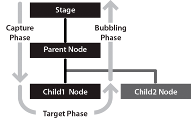

The DisplayObject class inherits from the EventDispatcher class. This means that every display object can participate fully in the event model (described in [Handling events](/docs/development/core-actionscript-classes/handling-events) ). Every display object can use its `addEventListener()` method—inherited from the `EventDispatcher` class—to listen for a particular event, but only if the listening object is part of the event flow for that event.

When Flash Player or AIR dispatches an event object, that event object makes a round-trip journey from the Stage to the display object where the event occurred. For example, if a user clicks on a display object named child1 , Flash Player dispatches an event object from the Stage through the display list hierarchy down to the child1 display object.

The event flow is conceptually divided into three phases, as illustrated in this diagram:

For more information, see [Handling events](/docs/development/core-actionscript-classes/handling-events) .

One important issue to keep in mind when working with display object events is the effect that event listeners can have on whether display objects are automatically removed from memory (garbage collected) when they’re removed from the display list. If a display object has objects subscribed as listeners to its events, that display object will not be removed from memory even when it’s removed from the display list, because it will still have references to those listener objects. For more information, see [Managing event listeners](/docs/development/core-actionscript-classes/handling-events#event-listeners) .
